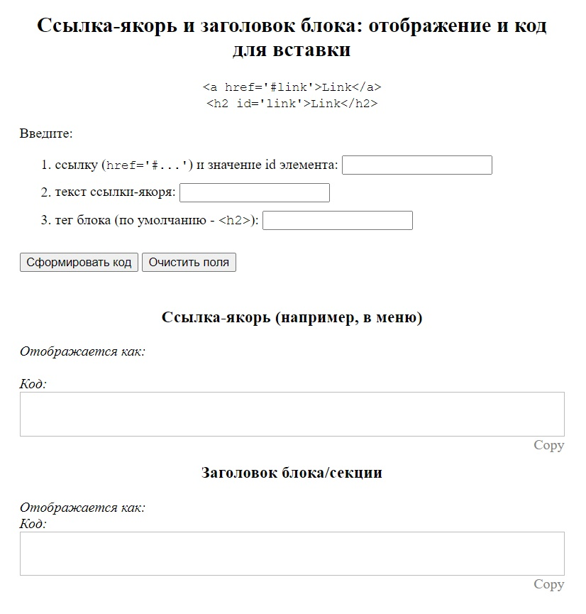
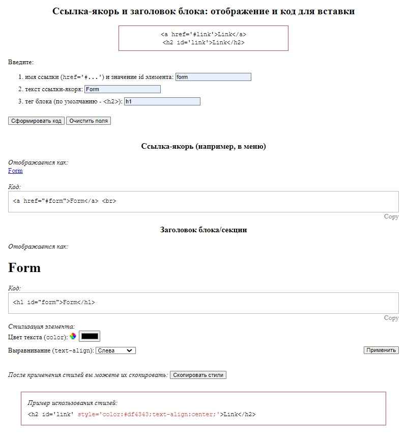
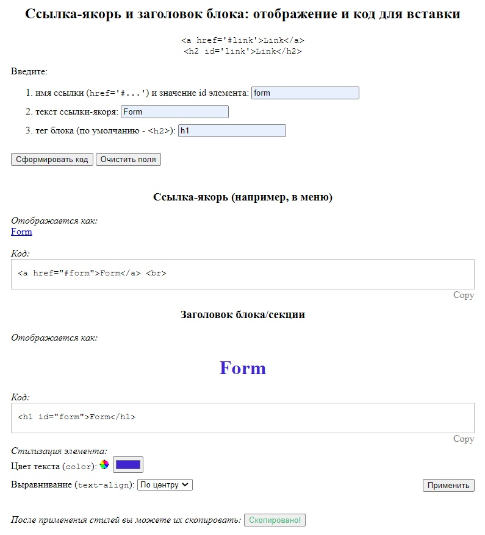

# Anchor links constructor (HTML | CSS | JS)

[Переключиться на английский | Switch to English](./README.md)

## О проекте
Приложение, которое выводит код ссылки-якоря и привязанного к ней блока по значениям, введенным пользователем в форму, а именно:
- имя ссылки (которое является также и id элемента);
- текст ссылки;
- тег блока.  

В поле вывода отображается код, который можно скопировать кликом по кнопке "Copy".  
После отображения кода становится доступна форма стилизации элемента.

**Инструменты:** 

**Языки:** 
 
 
 

**Демо:**  
[Перейти на сайт](https://the-all-spark.github.io/construct_anchor_links_app/)  
[Песочница на Codepen, версия 1.0](https://codepen.io/Lisovolk/pen/bGPgQZZ)  

## Реализованный функционал:
1. вывод предупреждения при отправке формы, если поля не заполнены (кроме последнего, т.к. предусмотрено значение по умолчанию);
2. адаптивная верстка (для ширины экрана от 1920 px до 300 px).

### Основная форма
3. при клике на кнопку "Сформировать код" (`submit`):
   - отмена перезагрузки страницы с формой;
   - сбор данных, введенных пользователем в форму;
   - вызов функции `displayMainLink` по построению ссылки-якоря;
   - вызов функции `displaySectionElem` по построению заголовка блока/секции;
   - вызов функции `displayStr` по преобразованию строки кода для его отображения на странице; 
   - отображение ссылки и заголовка на странице, а также кода - в блоке "Код";
   - отображение формы стилизации элемента (и вызов функции обработки отправки формы).
4. при клике на кнопку "Copy" - копирование соответствующего блока кода (текст кнопки при этом меняется на "Copied");
5. при клике на кнопку "Очистить поля" (`reset`):
   - удаление введенных в поля основной формы значений, а также выведенного кода; 
   - отображение текста "Copy" (вместо "Copied");
   - возврат значений полей формы стилизации к установленным по умолчанию;
   - отображение заголовка блока со стилями по умолчанию;
   - изменение текста кнопки копирования стилей и ее блокировка;
   - скрытие формы стилизации элемента.

### Форма стилизации элемента
6. при клике на кнопку "Применить" (`submit`):
   - отмена перезагрузки страницы с формой;
   - сбор выбранных пользователем параметров (цвет, выравнивание);
   - применение стилизации к отображаемому заголовку;
7. при клике на кнопку копирования стилей "Скопировать стили" (`click`):
   - разблокировка кнопки;
   - построение строки стилей (style ="...");
   - копирование строки и изменение текста и цвета кнопки на "Скопировано!";
   - возврат кнопке значений по умолчанию при последующем изменении любого из стилей (`change`).