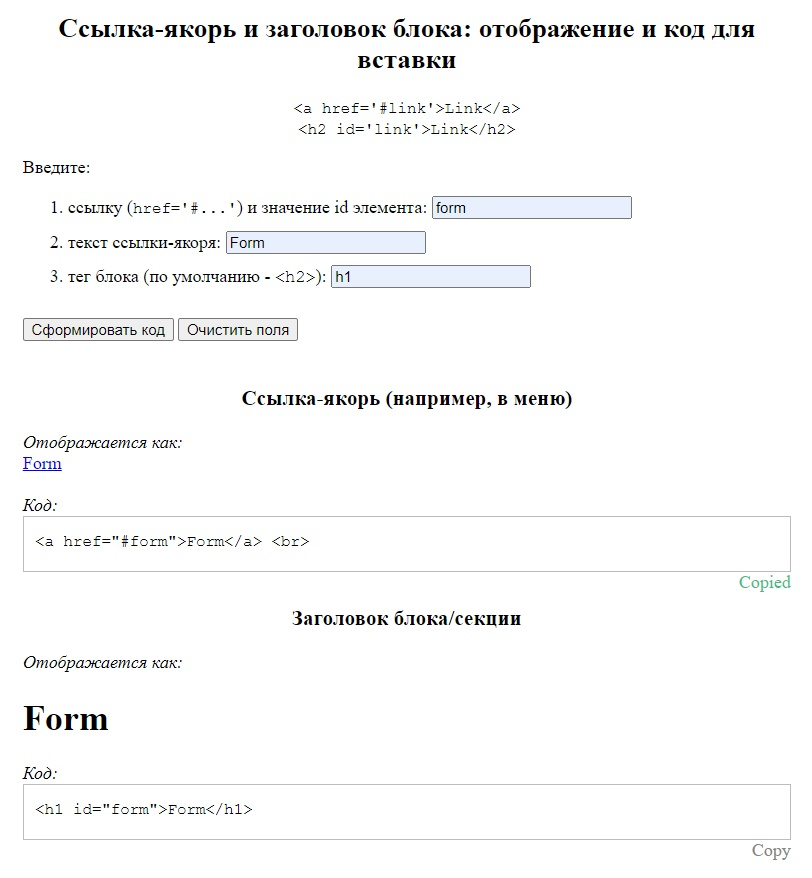

# Anchor links constructor (HTML | CSS | JS)

## О проекте
Приложение, которое собирает код ссылки-якоря и привязанного к ней блока по введенным пользователем в форму значениям:
- имя ссылки (которое является также и id элемента);
- текст ссылки;
- тег блока.  

В поле вывода отображается код, который можно скопировать кликом по кнопке "Copy".

**Инструменты:** 

**Языки:** 
 
 
 

**Демо:**  
[Перейти на сайт](https://the-all-spark.github.io/construct_anchor_links_app/)  
[Песочница на Codepen, версия 1.0](https://codepen.io/Lisovolk/pen/bGPgQZZ)  

## Реализованный функционал:
1. вывод предупреждения при отправке формы, если поля не заполнены (кроме последнего, т.к. предусмотрено значение по умолчанию);
2. при клике на кнопку "Сформировать код" (`submit`):
   - отмена перезагрузки страницы с формой;
   - сбор данных, введенных пользователем в форму;
   - вызов функции `displayMainLink` по построению ссылки-якоря;
   - вызов функции `displaySectionElem` по построению заголовка блока/секции;
   - вызов функции `displayStr` по преобразованию строки кода для его отображения на странице; 
   - отображение ссылки и заголовка на странице, а также кода - в блоке "Код".
3. при клике на кнопку "Copy" - копирование соответствующего блока кода (текст кнопки при этом меняется на "Copied");
4. при клике на кнопку "Очистить поля" (`reset`) - удаление введенных в поля значений, выведенного кода, отображение текста "Copy" (вместо "Copied").