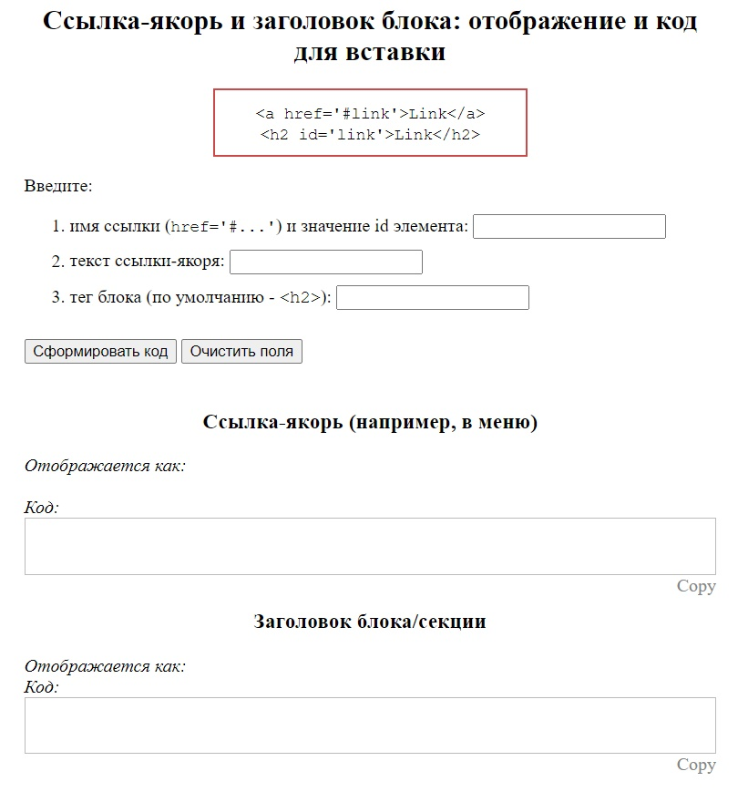
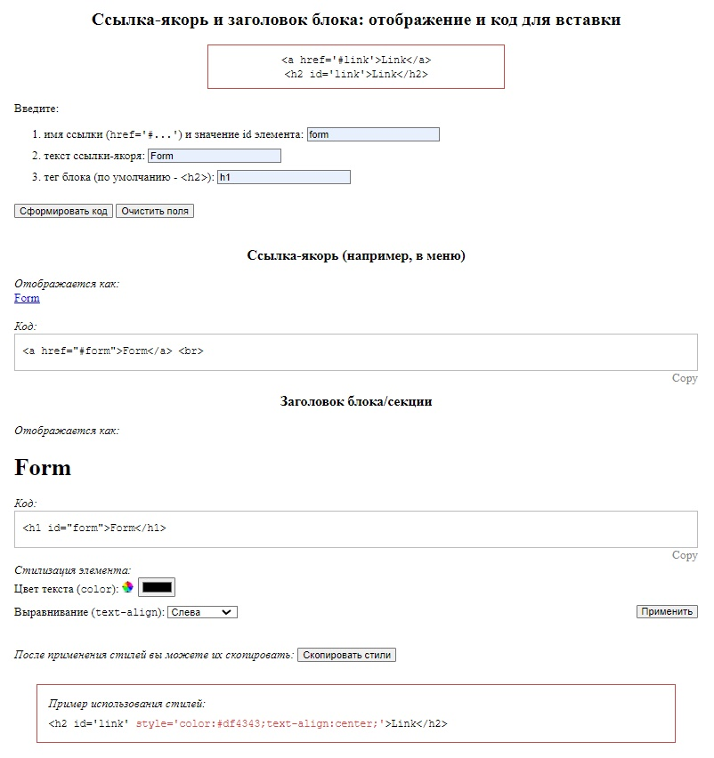
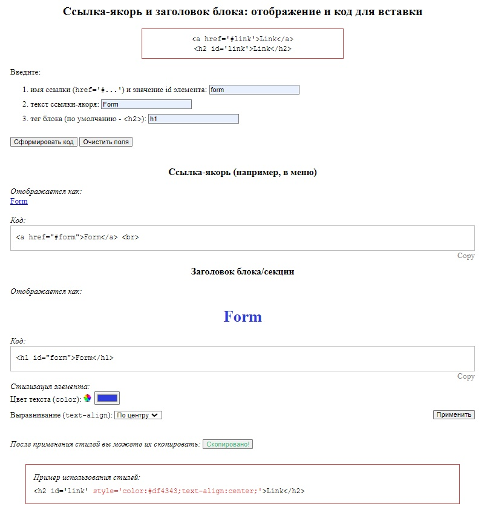

# Anchor links constructor (HTML | CSS | JS)

[Switch to Russian | Переключиться на русский](./README-ru.md)

## About the project
An application that outputs the code of an anchor link and its bound block according to the values entered by the user in a form, as follows:
- link name (which is also the id of the element);
- link text;
- block tag.  

The code is displayed in the output field, which can be copied by clicking on the “Copy” button.  
After the code is displayed, the element styling form becomes available.

**Tools:** 

**Stack:** 
 
 
 

**Demo:** [Go to site](https://the-all-spark.github.io/construct_anchor_links_app/)  
[Codepen, version 1.0](https://codepen.io/Lisovolk/pen/bGPgQZZ)  

## Realized functionality:
1. displaying a warning when submitting a form if the fields are not filled in (except for the last one, since a default value is provided);
2. responsive layout (for the screen width from 1920 px to 300 px).

### Main form
3. when clicking on the “Generate code” button  ("Сформировать код" ) (`submit`):
   - cancelling the reloading of the page;
   - collecting the data entered by the user in the form;
   - calling the `displayMainLink` function to build an anchor link;
   - calling of the `displaySectionElem` function to build a block/section header;
   - calling of the `displayStr` function to convert a code string in order to display it on the page; 
   - displaying the link and the heading on the page, as well as the code - in the “Code” block;
   - displaying the element styling form (and calling the form submission processing function).
4. when clicking on the “Copy” button - to copy the corresponding code block (the button text changes to “Copied”);
5. when clicking on the “Clear fields” button ("Очистить поля" ) (`reset`):
   - deleting the values entered in the fields of the main form, as well as the output code; 
   - displaying the text “Copy” (instead of “Copied”);
   - returning the values of the styling form fields to the default ones;
   - displaying the heading of the block with default styles;
   - changing the text of the style copy button and locking it;
   - hiding the element's styling form.

### Form of element styling
6. when clicking on the “Apply” button ("Применить") (`submit`):
   - cancelling the reloading of the page;
   - collecting parameters selected by the user (color, alignment);
   - application of stylization to the displayed heading;
7. when clicking on the style copy button “Copy styles” ("Скопировать стили") (`click`):
   - unlocking the button;
   - building a string of styles (style =“...”);
   - copying the string and changing the text and color of the button to “Copied!” ("Скопировано!");
   - returning the button to its default values when any of the styles is subsequently changed (`change`).